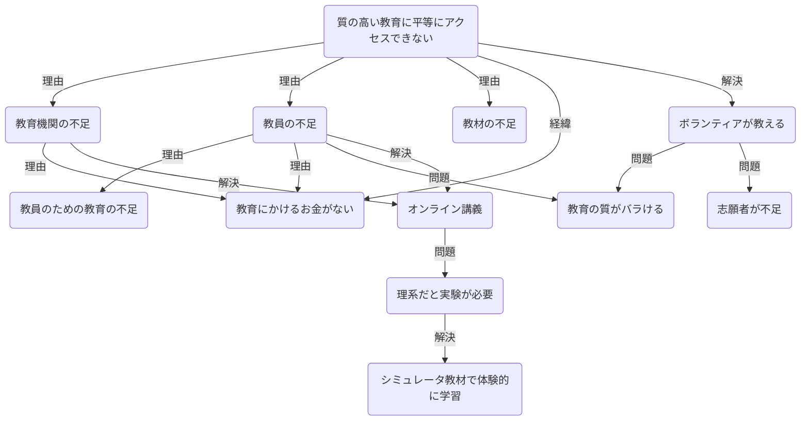

```mermaid
graph TD;
large(質の高い教育に平等にアクセスできない) -- 理由 --> m1(教育機関の不足);
large -- 理由 --> m2(教員の不足);
large -- 理由 --> m3(教材の不足);
large -- 経緯 --> m4(教育にかけるお金がない);
large -- 解決 --> m5(ボランティアが教える);
m1 -- 理由 --> m4;
m2 -- 理由　--> s21(教員のための教育の不足);
m2 -- 理由 --> m4;
m5 -- 問題 --> s51(教育の質がバラける);
m2 -- 問題 --> s51
m5 -- 問題 --> s52(志願者が不足);
m1 -- 解決 --> s11(オンライン講義);
m2 -- 解決 --> s11;
s11 -- 問題 --> ss11(理系だと実験が必要);
ss11 -- 解決 --> ss12(シミュレータ教材で体験的に学習);
```
